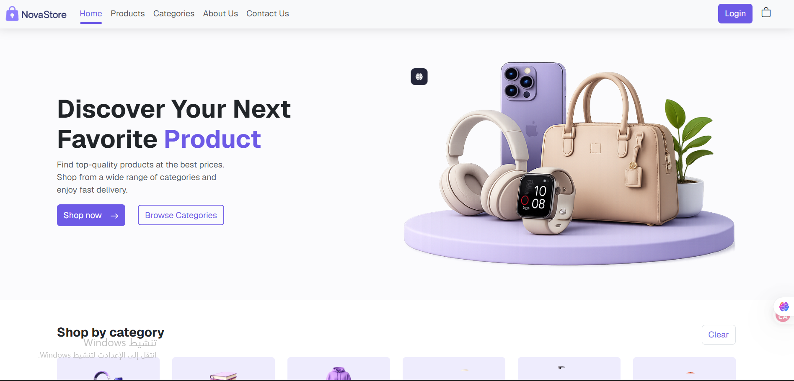
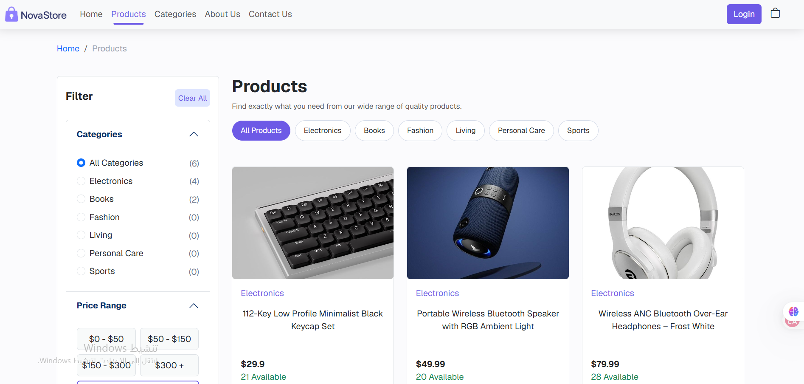
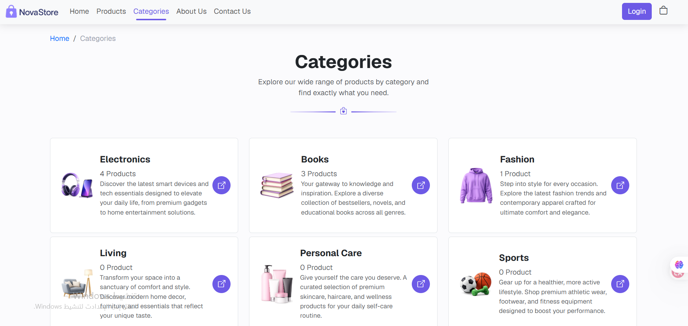
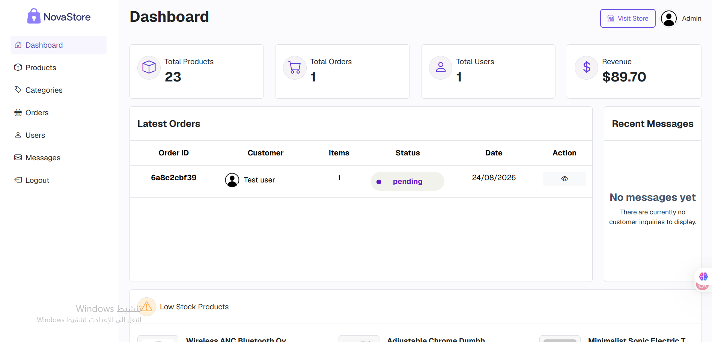
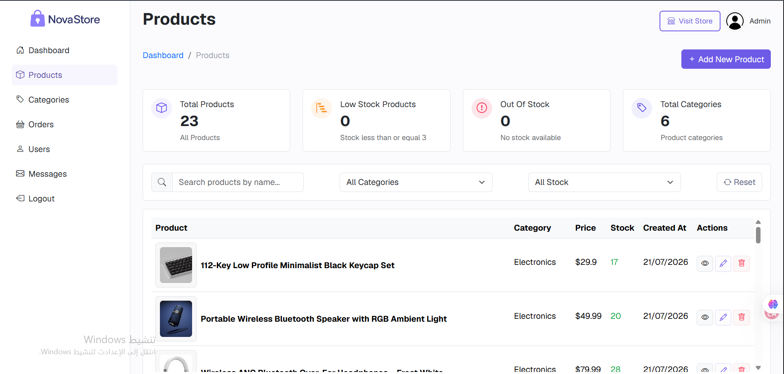
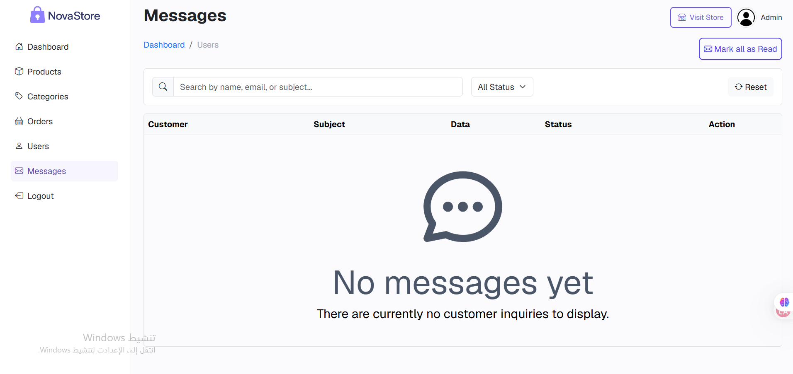

# NovaStore — Frontend

A customer-facing storefront and admin dashboard for **NovaStore**, a full-stack e-commerce platform built with **Vue 3, Vite, Pinia, and Vue Router**, consuming the [NovaStore backend API](https://github.com/MustafaKullab/novastore-backend).

> 🚀 **Live Demo:** [Open NovaStore](https://novastore-frontend-psi.vercel.app/)
> 🔗 **Backend:** [novastore-backend](https://github.com/MustafaKullab/novastore-backend)

---

## 📸 Screenshots

### 🛍️ Customer Experience

#### 🏠 Home



#### 🛒 Products



#### 🗂️ Categories



### 🧑‍💼 Admin Dashboard

#### 📊 Dashboard



#### 📦 Products Management



#### 💬 Messages



---

## ✨ Features

### 🛍️ Storefront

* Browse products by category
* View product details
* Search and filter products
* Shopping cart and checkout flow
* User registration and login
* Email verification
* Password reset
* Order history and order details
* User profile management
* Customer contact page

### 🧑‍💼 Admin Dashboard

* Overview dashboard with key store metrics
* Product management — add, edit, delete, and image upload
* Category management
* Order management — view orders and update order status
* User management
* Customer message inbox and reply functionality
* Search and filtering for administrative data

---

## 🧰 Tech Stack

| Layer            | Technology                            |
| ---------------- | ------------------------------------- |
| Framework        | Vue 3 (Composition API & Options API) |
| Build Tool       | Vite                                  |
| State Management | Pinia                                 |
| Routing          | Vue Router                            |
| Styling          | Bootstrap 5 + Bootstrap Icons         |
| Notifications    | vue3-toastify                         |
| Linting          | ESLint, oxlint                        |
| Formatting       | oxfmt                                 |

---

## 📁 Project Structure

```text
frontend store/
├── src/
│   ├── assets/              # Images and static assets
│   ├── components/          # Reusable UI components
│   │   ├── NavBar
│   │   ├── Footer
│   │   └── other shared components
│   ├── views/               # Customer and admin pages
│   ├── stores/              # Pinia stores
│   │   ├── user
│   │   ├── products
│   │   └── category
│   ├── router/              # Vue Router configuration
│   └── App.vue              # Root component
├── public/                  # Public assets
├── docs/
│   └── screenshots/         # README screenshots
├── index.html               # App entry HTML
└── vite.config.js           # Vite configuration
```

---

## 🚀 Getting Started

### Prerequisites

* Node.js `^22.18.0` or `>=24.12.0`
* The [NovaStore backend](https://github.com/MustafaKullab/novastore-backend) running locally
* Backend available at `http://localhost:7000` by default

### Installation

```bash
git clone https://github.com/MustafaKullab/novastore-frontend.git
cd novastore-frontend
npm install
```

### Run the development server

```bash
npm run dev
```

The app will be available at:

```text
http://localhost:5173
```

### Other scripts

```bash
npm run build    # Production build
npm run preview  # Preview the production build locally
npm run lint     # Lint and auto-fix with oxlint + eslint
npm run format   # Format source files with oxfmt
```

---

## 🔐 Demo Account

Want to explore the storefront without creating an account?

```text
Email: test@novastore.com
Password: test123
```

> This is a **regular customer account** for browsing, cart, checkout, and order history.
> It does **not** have admin access.

Admin credentials are not published publicly.

---

## ⚙️ Configuration

The frontend currently expects the backend API at:

```text
http://localhost:7000
```

If your backend runs at a different URL or port, update the API base URL used by the frontend, including the API calls in `src/stores/` and the `fetchWithRefresh` helper.

For production deployment, configure the frontend to use the deployed backend URL.

---

## 🗺️ Roadmap / Planned Improvements

* Centralize the API base URL into a single environment-based configuration
* Improve client-side route guards for smoother admin navigation
* Persist guest cart data and merge it on login
* Extract shared form validation logic into reusable composables
* Continue improving responsive behavior and overall UX

---

## 👨‍💻 Author

**Mustafa Kullab**

Built as a personal project to apply and deepen **Vue.js and frontend development skills** while developing a complete full-stack e-commerce application.
